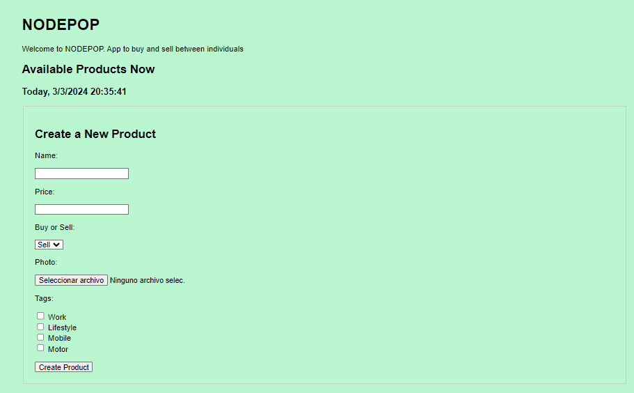
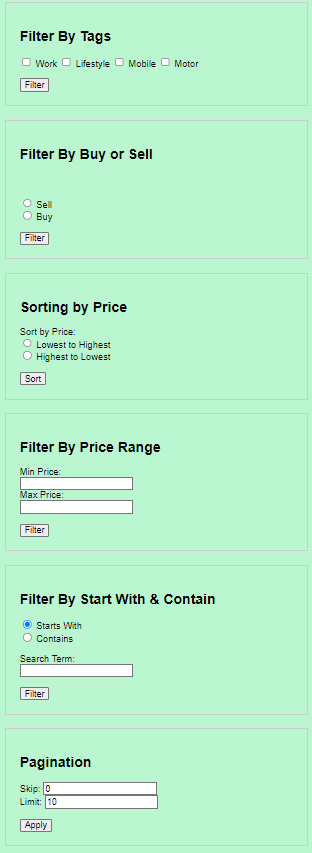
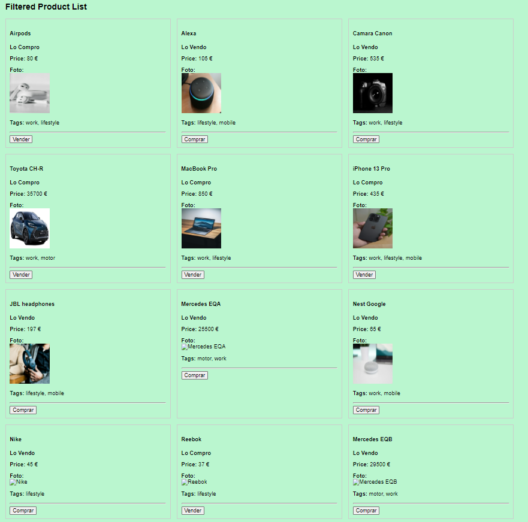

# Nodepop

### Welcome to NODEPOP. App to buy and sell between individuals

## Table of Contents

- [Nodepop](#nodepop)
    - [Welcome to NODEPOP. App to buy and sell between individuals](#welcome-to-nodepop-app-to-buy-and-sell-between-individuals)
  - [Table of Contents](#table-of-contents)
  - [NODEPOP v.1 Feature Summary](#nodepop-v1-feature-summary)
  - [Install Dependencies](#install-dependencies)
  - [Initialize the database](#initialize-the-database)
  - [Development](#development)
  - [API routes](#api-routes)
    - [Future Improvements](#future-improvements)
    - [License](#license)
    - [Contributions](#contributions)
    - [Contact](#contact)
    - [Acknowledgements](#acknowledgements)

## NODEPOP v.1 Feature Summary

In this first version of the NODEPOP application, for buying and selling between individuals, we can do the following operations:

`Create` an item from the main view

`Filters`
- By name to search for a certain item if we know the exact name
- We can filter and ask it to show us all the articles that start with a certain letter or that contain a certain string of characters
- We can filter by type of operation, if we only want to see Sale or Purchase operations
Filter by Tags, to see articles related to a certain tag
- By price range-
- We can paginate and limit the number of articles per page

If we have the 'id' number of the article, we can search for it directly, update it or delete it.

We can also select the fields that we want to be shown in the results (_next implementation in the application view_)


## Install Dependencies

```js
npm install
```

## Initialize the database

**⚠️`WARNING`⚠️**

The next command deletes the database

```sh
npm run init-db
```

## Development

To start the application the development mode you can use:

```sh
npm run dev
```

## API routes

**`Products List`**

```sh
GET /api/products
```

```json
{
  "results": [
    {
      "_id": "65e0a6820f64f2cceb437c3e",
      "name": "MacBook Pro",
      "venta": true,
      "price": 888,
      "foto": "macbook.jpg",
      "tags": ["work", "lifestyle"]
    }
  ]
}
```

**`Single Product`**

`GET /api/products/:id`

This route returns the details of a specific product identified by its ID.

```json
{
  "result": {
    "_id": "65e0a6820f64f2cceb437c3e",
    "name": "MacBook Pro",
    "venta": true,
    "price": 888,
    "foto": "macbook.jpg",
    "tags": ["work", "lifestyle"]
  }
}
```

`List of Existing Tags`

```sh
GET /api/products/tags/existing
```

This route returns a list of existing tags in the products.

```json
{
  "tags": [
    "lifestyle",
    "mobile",
    "motor",
    "work"
  ]
}
```


`Update Product`

```sh
PUT /api/products/<_id>
```

This route updates the details of an existing product identified by its ID.

`Create a new Product`

```sh
POST /api/products/
```

This route creates a new product. The details of the product must be sent in the request body.

`Delete a Product`

```sh
DELETE /api/products/<_id>
```

```json
{
    "message": "Product deleted successfully"
}
``
```


_This is the main page of the application_ 




`GET (Get Data):`

Supports filters, pagination and sorting through query parameters:

_Image of the different filter options to search_



And after filtering, this is the image of the filtered results



To see all the available items, this is the URL → `http://localhost:3000/api/products`

This is the list of URLs to access the code's functionalities. The API is mounted under the prefix /api/products:


**?name=value**

```json
http://localhost:3000/api/products?name=Airpods
```

**?sale=true|false**

```json
http://localhost:3000/api/products?sale=false
```

**?tags=tag1,tag2**

```json
http://localhost:3000/api/products?tags=work&tags=motor
```

**?fields=fields1,fields2**

```json
http://localhost:3000/api/products?fields=name&fields=price
```

**?minPrice=50** & **?maxPrice=100**

```json
http://localhost:3000/api/products?minPrice=50&maxPrice=110
```

**?searchType=startsWithLetter=a**

```json
http://localhost:3000/api/products?searchType=startsWith&searchTerm=m
```

**?searchType=containsString=search**

```json
http://localhost:3000/api/products?searchType=contains&searchTerm=pro
```

**?skip=5** & **?limit=10**

```json
http://localhost:3000/api/products?skip=2&limit=4
```

**?sortByPrice=asc || ?sortByPrice=desc**

```json
http://localhost:3000/api/products?sortByPrice=asc
http://localhost:3000/api/products?sortByPrice=desc
```

**Get an individual product:**

`http://localhost:3000/api/products/:id` (replace :id with the ObjectId of the product)

**Get List existing tags:**

`http://localhost:3000/api/products/tags/existing`

```json
http://localhost:3000/api/products/tags/existing
```

```json
{
  "tags": ["lifestyle", "mobile", "motor", "work"]
}
```

`PUT (Update data):`

**Update a product:**`

`http://localhost:3000/api/products/:id`
(PUT method, sending the updated data in the body of the request)

`POST (Create data):`

**Create a new product:**

`http://localhost:3000/api/products `
(POST method, sending the data of the new product in the body of the request)

`DELETE (Delete data):`

**Delete a product:**
`http://localhost:3000/api/products/:id `
(DELETE method)

These URLs assume that your API is running on a local server on port 3000. If your configuration is different, adjust the URLs accordingly.
The format of the data to be sent in the POST and PUT requests must be JSON, following the structure of the Products collection in your Mongoose database.

### Future Improvements
This is the first version of the application, and further enhancements are planned to enhance its functionality and user experience. Some of the improvements planned for future versions include:

`Combining Filters:` Implementing the ability to combine multiple filters for more refined search results, providing users with greater flexibility and precision in their product searches.

`Tag List Visualization:` Enhancing the user interface by displaying a list of available tags on the screen, allowing users to easily navigate through product categories and filter their search results based on specific tags. Additionally, each tag will be linked to the corresponding articles with those tags, providing users with seamless navigation and access to relevant products.

### License
-

### Contributions
We welcome contributions from the community! If you'd like to contribute to the project, please follow these steps:

- Open an issue to report bugs or suggest improvements.
- Fork the repository.
- Create a branch for your new feature: git checkout -b my-new-feature.
- Commit your changes: git commit -am 'Add a new feature'.
- Push your changes to the branch: git push origin my-new-feature.
- Submit a pull request.

### Contact
For any questions, suggestions, or feedback about the project, feel free to reach out. You can email us at syradominguez.dev@gmail.com

### Acknowledgements

Thanks to Javier Miguel (https://github.com/jamg44), our teacher at the Web Development Bootcamp, for having explained to us with such simplicity and in a fun way the first layers of the backend world. You have made me not so afraid and until I understand it 😊

